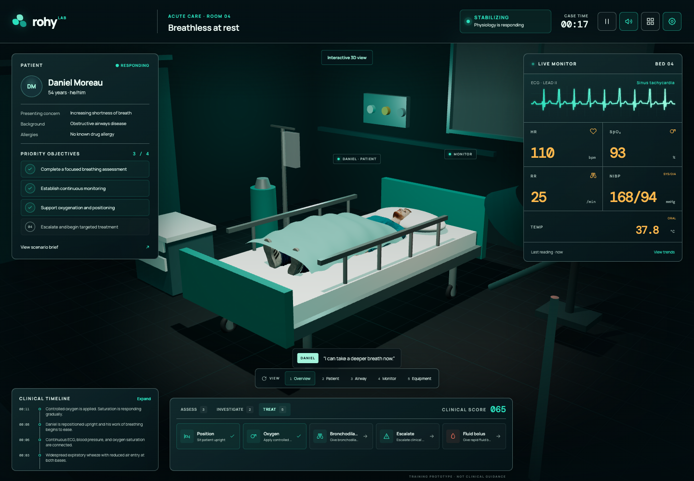
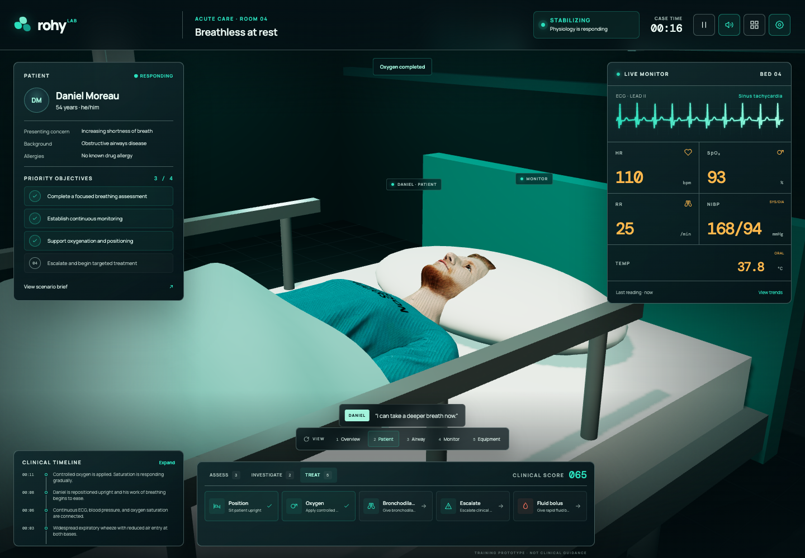

# Rohy 3D Patient Room

An original, browser-based clinical simulation prototype for Rohy. The experience places a textured, full-body rigged patient in a procedural 3D hospital room and links clinical actions to live physiology, patient reactions, objectives, scoring, and a replayable timeline.





## Run locally

```bash
npm install
npm run dev
```

Open the local address shown by Vite. The production bundle can be created with:

```bash
npm run build
```

## Verify

```bash
npm test
npm run test:browser
```

The browser test launches an isolated headless Chrome session, exercises the room and clinical controls at desktop and mobile sizes, and saves its evidence to `tmp/`.

## Included experience

- Full procedural room: patient bed, shaped blanket, monitor, oxygen station, IV pole, cabinet, examination lamp, window, and privacy curtain.
- Textured 1.815 m AvatarSDK patient with a 73-joint full-body skeleton, separate clothing and shoes, facial morph targets, and a neutral supine pose.
- Live patient behavior: respiratory-rate-driven breathing effort, blinking, subtle head and shoulder movement, status-sensitive complexion, and bedside status-light changes.
- Responsive vital signs and animated ECG waveform.
- Assess, investigate, and treat action groups with immediate clinical feedback.
- Four learning objectives, clinical score, patient dialogue, timeline, and outcome checkpoint.
- Clickable 3D objects plus five camera presets.
- Pause, mute, high-contrast, simplified dashboard, keyboard, and reduced-motion support.
- WebGL fallback that preserves the accessible clinical controls.

## Architecture

- `src/simulation.js` is a deterministic, renderer-independent scenario engine.
- `src/scene.js` creates the Three.js room, loads and poses the rigged avatar, and animates its physiology.
- `src/main.js` binds the simulation to the accessible HTML interface and lazy-loads the 3D scene.
- `tests/` covers physiology, state transitions, room composition, rig animation, avatar structure, licensing, and input validation.
- `scripts/browser-smoke.mjs` provides dependency-free browser regression coverage through Chrome DevTools Protocol.

The room and equipment geometry are created in code. The bundled example patient is Rohy's existing AvatarSDK full-body GLB from the MIT-licensed TalkingHead demonstration set; attribution is recorded in [`THIRD_PARTY_NOTICES.md`](THIRD_PARTY_NOTICES.md). If the model cannot load, an accessible procedural fallback keeps the scenario usable. Clinical content is demonstrative and is explicitly labeled as a training prototype, not clinical guidance.
